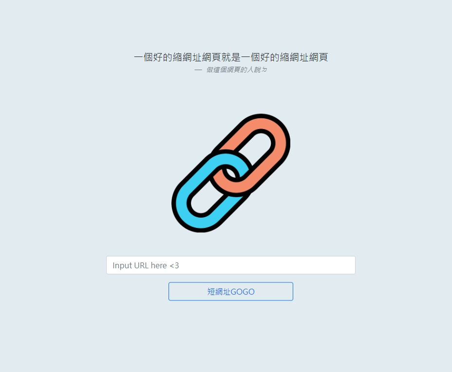
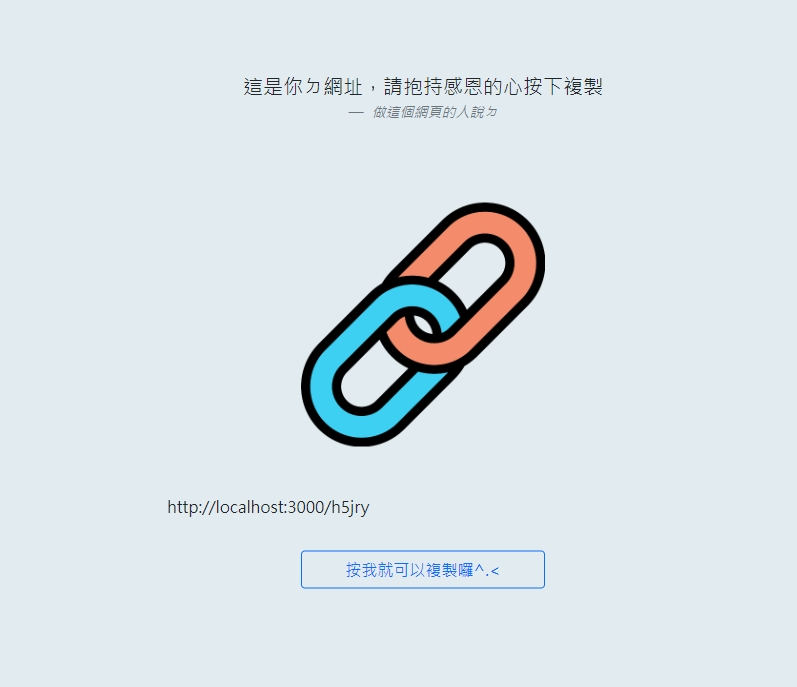

# 短網址產生器！！！

### 專案畫面展示


## 專案說明
你覺得你的網頁總是太長
原本只是想分享的網址，丟給朋友卻是落落長一大串嗎???

## 短網址產生器
#### 由此誕生｡:.ﾟヽ(*´∀`)ﾉﾟ.:｡

## 專案功能


將原本的長網址放進去，按下"短網址GOGO"
就會出現比較短的網址囉！


將你的短網址輸入到瀏覽器中
就會出現原本的網址了！

## 如何使用

```
1. 請先安裝npm還有nodemon，沒安裝? 就去安裝ㄅ^.<
```
```
2. 把這個專案clone到你的電腦中
~~如果你要照著我一字一句自己慢慢打我也是可以啦030~~
```
```
3. 使用終端機開啟然後進到這個資料夾(cd shortURL) 
```
```
4. 進入後在終端機輸入"npm run start"
```
```
5. 看見"gogo"的訊息時，打開瀏覽器進入網址"http://localhost:3000/"
```
```
6. 開始你的縮網址吧！
```
```
7. 要暫停請按"ctrl + c"
```

